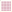

# kicad-mil-ipc7351-footprint-generator

**Open-source, state-of-the-art IPC-7351C footprint generator for KiCad focused on MIL-STD, aerospace, and high-reliability applications.**

A free alternative to **PCB Footprint Expert (Library Expert)** that produces production-ready, MIL-grade footprints with full tolerance stacking, J-STD-001 compliance, and high-reliability presets.


---

## Screenshots

Footprints rendered by **KiCad 10.0.1** via `kicad-cli fp export svg`:

| Chip 1206 (Density A + MIL) | SOIC-8 (Density B) |
|:---:|:---:|
|  |  |

| DIP-8 (Dual-row THT) | QFN-32 (with Thermal Pad) |
|:---:|:---:|
|  |  |

| BGA-256 (Full 16×16 Grid) |
|:---:|
|  |

---

## Features

- Full **IPC-7351B / IPC-7351C** compliance
- 3 density levels: **Density A (Most – MIL preferred)**, B (Nominal), C (Least)
- 4 package families: **Chip** (resistors/capacitors), **Gullwing** (SOIC/QFP/QFN), **BGA/LGA/CSP**, **Through-hole** (DIP/axial/radial)
- MIL-grade derating (+0.05mm pads, +0.1mm courtyard)
- Tolerance stacking: **Nominal, Min/Max, RSS, Worst-Case**
- Advanced pad shapes: rounded rectangle, oblong, circle
- Automatic courtyard (per IPC-7351 pad-based calculation)
- Thermal pad generation for QFN/DFN packages
- BGA full grid layout (16×256 balls)
- THT dual-row placement (DIP) and single-row (SIP, axial)
- KiCad s-expression output (`.kicad_mod` + `.pretty` library)
- PDF calculation report with all formulas and tolerances
- Batch generation from CSV
- CLI mode (`kicad-mil-fpgen --package chip --body-length 3.2 ...`)
- GUI mode with live 2D preview and validation (PySide6)
- All layers: F.Cu, F.Paste, F.Mask, F.CrtYd, F.SilkS, F.Fab
- F.Fab pin 1 marker
- THT layers: F.Cu + B.Cu

## Why This Project Exists

Commercial tools like PCB Library Expert are excellent but expensive and closed-source. This project aims to provide the **high-reliability community** (defense, aerospace, medical, space) with a transparent, auditable, and free tool that meets or exceeds MIL-PRF and IPC Class 3 requirements.

All footprints validated against **KiCad 10.0.1 pcbnew** — every generated file loads, parses, and renders correctly.

---

## Installation

### From Source

```bash
git clone https://github.com/YOURNAME/kicad-mil-ipc7351-footprint-generator.git
cd kicad-mil-ipc7351-footprint-generator
pip install -e .
kicad-mil-fpgen          # launches GUI
kicad-mil-fpgen --help   # CLI mode
```

### Requirements

- Python 3.11+
- PySide6 (for GUI mode)
- KiCad (for SVG export — footprints work standalone)

---

## Quick Start

**GUI mode:**
```bash
kicad-mil-fpgen
```

**CLI mode:**
```bash
kicad-mil-fpgen --package chip --body-length 3.2 --body-width 1.6 --density A --mil --output my_footprint.kicad_mod
```

**Batch import:**
```bash
kicad-mil-fpgen --package soic --body-length 5.0 --body-width 4.0 --lead-count 8 --lead-pitch 1.27 --output soic8.kicad_mod
```

---

## Repository Structure

```
kicad-mil-ipc7351-footprint-generator/
├── src/kicad_mil_fpgen/
│   ├── __init__.py / __main__.py
│   ├── core/
│   │   ├── ipc7351.py       # Data models (PackageDefinition, FootprintResult, etc.)
│   │   ├── families.py      # 4 package family calculators + dispatch
│   │   ├── constants.py     # Enums, factor tables, MIL constants
│   │   ├── tolerances.py    # Tolerance stacking (Nominal, RSS, Worst-Case)
│   │   ├── padstack.py      # PadShape enum
│   │   └── calculator.py    # FootprintCalculator wrapper
│   ├── export/
│   │   ├── kicad_mod.py     # KiCad .kicad_mod exporter
│   │   ├── report.py        # PDF calculation report
│   │   └── batch_import.py  # CSV batch import
│   └── gui/
│       ├── main_window.py   # PySide6 application
│       ├── wizard.py        # Step-by-step wizard
│       └── preview.py       # matplotlib 2D preview
├── ipc_data/                # IPC formula reference tables
├── tests/                   # 142 tests
├── docs/images/             # SVG screenshots
└── pyproject.toml
```

---

## Comparison: KiCad MIL IPC7351 vs PCB Footprint Expert

| Feature | PCB Footprint Expert | KiCad MIL IPC7351 |
|---------|---------------------|-------------------|
| License | Commercial / Paid | **Free (GPLv3)** |
| IPC-7351C | ✓ | ✓ |
| Density Levels | 3 | **3 + MIL derating** |
| Tolerance Stacking | Nominal only | **Nominal, Min/Max, RSS, Worst-Case** |
| MIL Presets | ✗ | **Built-in** |
| PDF Calculation Report | Limited | **Full (all formulas transparent)** |
| Batch Generation | ✓ | ✓ (CSV) |
| Cross-Platform | Windows only | **Windows, Linux, macOS** |
| 2D Preview | ✓ | ✓ (matplotlib) |
| CLI Mode | ✗ | **✓** |
| Thermal Pads | ✓ | **✓ (QFN/DFN)** |
| BGA Grid | ✓ | **✓ (full N×N)** |
| Dual-row THT | ✓ | **✓ (DIP)** |
| F.Fab Pin 1 Marker | ✓ | **✓** |

---

## MIL / High-Reliability Usage Guide

For high-reliability designs (MIL-PRF, IPC Class 3, aerospace):

1. Always select **Density A (Most)** for maximum solder joint strength
2. Enable **`--mil`** flag for:
   - +0.05mm to every pad dimension
   - +0.1mm extra courtyard clearance
   - Vibration-resistant pad geometry
3. Use **Worst-Case tolerance stacking** for critical MIL paths
4. Generate PDF report for every footprint → include in design documentation

**Example:** MIL-grade SOIC-8
```bash
kicad-mil-fpgen --package soic --body-length 5.0 --body-width 4.0 \
  --lead-count 8 --lead-pitch 1.27 --density A --mil --output soic8_mil.kicad_mod
```

---

## API Usage

```python
from kicad_mil_fpgen.core.families import calculate, apply_mil_derating
from kicad_mil_fpgen.core.ipc7351 import PackageDefinition, BodyDimensions, Tolerance
from kicad_mil_fpgen.export.kicad_mod import KiCadModExporter

pkg = PackageDefinition(family="chip",
    body=BodyDimensions(length=Tolerance(3.2), width=Tolerance(1.6), height=Tolerance(0.55)))
result = calculate(pkg, density="A")
mil_result = apply_mil_derating(result)

exporter = KiCadModExporter(mil_result)
exporter.export("chip_1206_mil.kicad_mod")
print(f"Generated {len(mil_result.pads)} pads, courtyard {mil_result.courtyard.width:.2f}x{mil_result.courtyard.height:.2f}mm")
```

---

## Contributing

Contributions welcome! Priority areas:
- Additional package families (connectors, crystals, LEDs)
- IPC-7352 support
- 3D model generation
- KiCad action plugin integration
- Web version (Streamlit/Gradio)

---

## License

**GPL-3.0-or-later** — See [LICENSE](LICENSE).

---

## Status

**Beta** — 142 automated tests, validated against KiCad 10.0.1 pcbnew.
